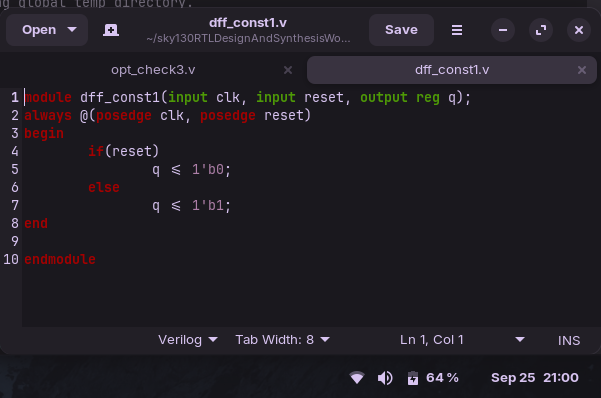

# Day 3: Combinational and Sequential Optimization

---

## 📑 Table of Contents
- [Constant Propagation](#constant-propagation)  
- [State Optimization](#state-optimization)  
- [Cloning](#cloning)  
- [Retiming](#retiming)
- [Labs On Optimization](#5-labs-on-optimization)
  - [Combinational Logic Optimization](#combinational-logic-optimization)
     - [Labs1](#lab-1)
     - [Labs2](#lab2)
     - [Labs3](#lab-3)
     - [Labs4](#lab-4) 
  - [Sequential Logic Optimization](#sequential-logic-optimization)
     - [Labs5](#lab-5)
     - [Labs6](#lab-6)

- [summary](#summary)

---

## Constant Propagation  
### 1. What is it?  
- Replace signals driven by **constant values (0 or 1)** with fixed logic.  
- Eliminates unnecessary gates and wires.  

### 2. Detailed Info  
Constant propagation checks if a net or signal always evaluates to a fixed value and simplifies the circuit accordingly. For example, if a gate input is always `0`, the output can be optimized to `0` without the actual logic.  

### Advantages  
- Reduces **gate count**  
- Simplifies **logic equations**  
- Improves **area and power efficiency**  

---

## State Optimization  
### 1. What is it?  
- Reduces the number of **states in a finite state machine (FSM)** by merging equivalent or unreachable states.  

### 2. Detailed Info  
In FSMs, some states may be redundant (behaving the same as others) or unreachable. State optimization identifies and removes them, leading to a minimal FSM.  

###  Advantages  
- Reduces **flip-flop count**  
- Improves **timing** (fewer state transitions)  
- Lower **area and power** usage  

---


## Cloning  
### 1. What is it?  
- Duplicate logic or registers to **reduce fanout** and **improve timing**.  

### 2. Detailed Info  
If a single gate or flip-flop drives many loads, the delay increases. Cloning creates a copy of that logic/register so loads are split between them.  

###  Advantages  
- Reduces **net delay** from high fanout  
- Improves **timing closure**  
- Helps achieve **higher operating frequency**

---

## Retiming  
### 1. What is it?  
- **Reposition registers (flip-flops)** in a circuit without changing functionality.  

### 2. Detailed Info  
Retiming balances combinational delays by moving flip-flops across logic gates. It helps meet setup/hold timing while preserving overall input-output behavior.  

###  Advantages  
- Optimizes **critical path delay**  
- Enables **higher clock frequency**  
- Balances **pipeline stages** for better performance  

---

# 5. Labs On Optimization

Optimization in digital design ensures **minimal area**, **reduced power consumption**, and **improved timing performance**.  
This lab explores **Combinational** and **Sequential Logic Optimization** techniques.

---

## 🔹 Combinational Logic Optimization
###  Objective:
Squeeze and simplify logic to achieve the **most optimized design** in terms of **area** and **power**.

---

###  Techniques:

#### 1. Constant Propagation
- Replaces **logic blocks with constants** when input values are fixed.  
- **Example:**
  `Y = ((A·B) + C)'
If A = 0 → Y = (0 + C)' = C'`

- **Result:**  
- Complex gate logic → **6 MOS transistors**  
- Simplified to → **1 inverter (2 MOS transistors)** 

---

#### 2. Boolean Logic Optimization
- Simplify Boolean expressions using:
- Karnaugh Map (K-Map)  
- Quine McCluskey Method  
- **Example Verilog:**
```verilog
assign y = a ? (b ? c : (c ? a : 0)) : (!c);
```
  - Optimized Expression:
    
     `y = a ⊕ c`

  ### Yosys Optimization Commands:
  
  - The command to perform logic optimization in Yosys is opt_clean.
    ```
       opt_clean
    ```
  - Additionally, for a hierarchical design involving multiple sub-modules, the design must be flattened by running the flatten command before executing the opt_clean command.
   ```
    flatten
   ```
  ### Full Flow:

  ```
  synth -top <module_name>
  opt_clean -purge
```
- `opt_clean` → removes unused wires and cells

- `-purge`    → also removes internal nets with public names
 ---

## 🔹 Sequential Logic Optimization

### Basic Techniques:
 
#### 1.Sequential Constant Propagation:

- Propagates known constant values through flip-flops during synthesis.

 **Advanced Techniques:**
 
 #### 1. State Optimization

- Reduces the number of FSM states → optimizing area and transitions.

 #### 2. Retiming

Moves registers across logic boundaries to balance delay and improve timing.

 #### 3. Sequential Logic Cloning

- Duplicates logic in floorplan-aware synthesis to meet timing and congestion goals.

**Outcome:**
- These optimization techniques ensure faster, smaller, and power-efficient circuits, ready for real-world chip design.

---
### **To get start through the optimization of design logic**

**Go through the step by step worflow**

#### 1. **locate the file** in your project directory. 

This is done using,
```bash
cd ~/sky130RTLDesignAndSynthesisWorkshop/verilog_files
```
#### 2. **list the optimization designs**

 By  Running :
 
 ```
 ls *opt*
```

#### 4. **list the sequential optimization designs**
 By  Running :
 
 ```
 ls *dff*
```

## Combinational Logic Optimization

## Lab 1 :

to see the verilog logic of Lab1.

Run:
```
gedit opt_check.v
```


#### Explanation:

- assign y = a ? b : 0; means:
- If a is true, y is assigned the value of b.
- If a is false, y is 0.

#### 5: lanch yosys:
```
yosys
```
#### 6. **Run this command inside yosys:**
```
read_liberty -lib ~/sky130RTLDesignAndSynthesisWorkshop/lib/sky130_fd_sc_hd__tt_025C_1v80.lib
read_verilog opt_check.v
synth -top opt_check
opt_clean -purge
dfflibmap -liberty ~/sky130RTLDesignAndSynthesisWorkshop/lib/sky130_fd_sc_hd__tt_025C_1v80.lib
abc -liberty ~/sky130RTLDesignAndSynthesisWorkshop/lib/sky130_fd_sc_hd__tt_025C_1v80.lib
show
```


Statistics:


After view the Dot file :
run:
```
exit
# to exit from yosys
```
## Lab2:

#### 1.to see the verilog logic of Lab2.

Run:
```
gedit opt_check2.v
```


**Code Analysis**:

Acts as a multiplexer:
- y = 1 if a is true.
- y = b if a is false.

#### 2: lanch yosys:
```
yosys
```
#### 3. **Run this command inside yosys:**
```
read_liberty -lib ~/sky130RTLDesignAndSynthesisWorkshop/lib/sky130_fd_sc_hd__tt_025C_1v80.lib
read_verilog opt_check2.v
synth -top opt_check2
opt_clean -purge
dfflibmap -liberty ~/sky130RTLDesignAndSynthesisWorkshop/lib/sky130_fd_sc_hd__tt_025C_1v80.lib
abc -liberty ~/sky130RTLDesignAndSynthesisWorkshop/lib/sky130_fd_sc_hd__tt_025C_1v80.lib
show
```

see something like :


Statistics:


After view the Dot file :

run:
```
exit
# to exit from yosys
```

## Lab 3 :

**The follow before steps  for all process . Just adjust the file name**

here the optimization design is `opt_check3`

**The verilog logic of Lab3.**


Explanation:

Three inputs (a, b, c), output y.
Nested ternary logic:
If a = 1, y = c.
If a = 0, y = !c.
Logic simplifies to:
y = a ? c : !c

Dot file:


## Lab 4 :

**The verilog logic of Lab4.**


Functionality:

- Three inputs (a, b, c), output y.
- Nested ternary logic:
- If a = 1, y = c.
- If a = 0, y = !c.
- Logic simplifies to:
- y = a ? c : !c


##Sequential Logic Optimization

## Lab 5 :
 
Verilog code:
 


**Functionality:**

- D flip-flop with:
    - reset to 0
    - Loads constant 1 when not in reset

Dot file:


## Lab 6 :

Verilog code:


## Functionality of `dff_const2`

- On **reset** (`posedge reset`): `q` becomes `1`.  
- On **clock edge** (`posedge clk`): `q` also becomes `1`.  
- Therefore, output `q` is **always `1`**, independent of clock or reset.

### After Synthesis
The flip-flop is redundant.  
The circuit is optimized to:

    assign q = 1'b1;


Dot file :


## Summary

##  Summary   

- **Combinational Optimization Techniques:** 

  - **Constant Propagation:** Replaces logic with constants → fewer gates, less power.  
  - **Boolean Logic Optimization:** Uses K-Map / Quine-McCluskey to simplify expressions.  

- **Sequential Optimization Techniques:** 

  - **State Optimization:** Minimizes FSM states → reduces flip-flops and transitions.  
  - **Retiming:** Moves registers to balance delay → improves timing.  
  - **Cloning:** Duplicates logic/registers to reduce fanout → helps timing closure.  

- **Yosys Commands Used:**  

  - `flatten` → Converts hierarchical design into flat design.  
  - `opt_clean -purge` → Removes unused nets and redundant logic.  
  - `dfflibmap` / `abc` → Map logic to technology libraries for synthesis.  

- **Lab Outcomes:**  
  - Optimized designs show reduced **transistor count, logic levels, and area**.  
  - Some flip-flops collapsed into constants → saving resources.  
  - Visualized **dot files** confirm simplifications in synthesized netlists.  

 By applying these optimizations, designs become **smaller, faster, and more power-efficient**, ready for real-world VLSI implementation.  


