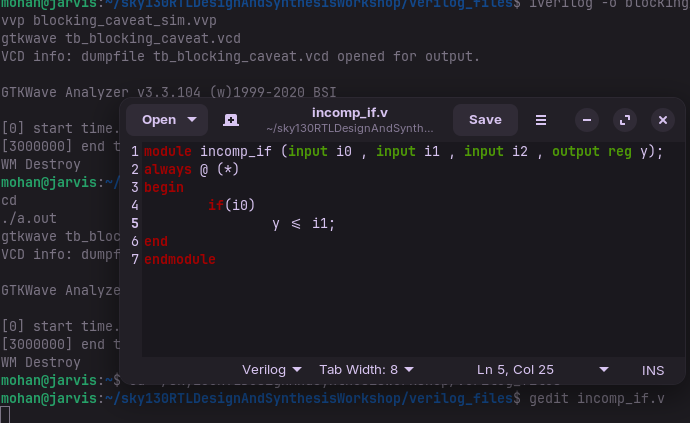
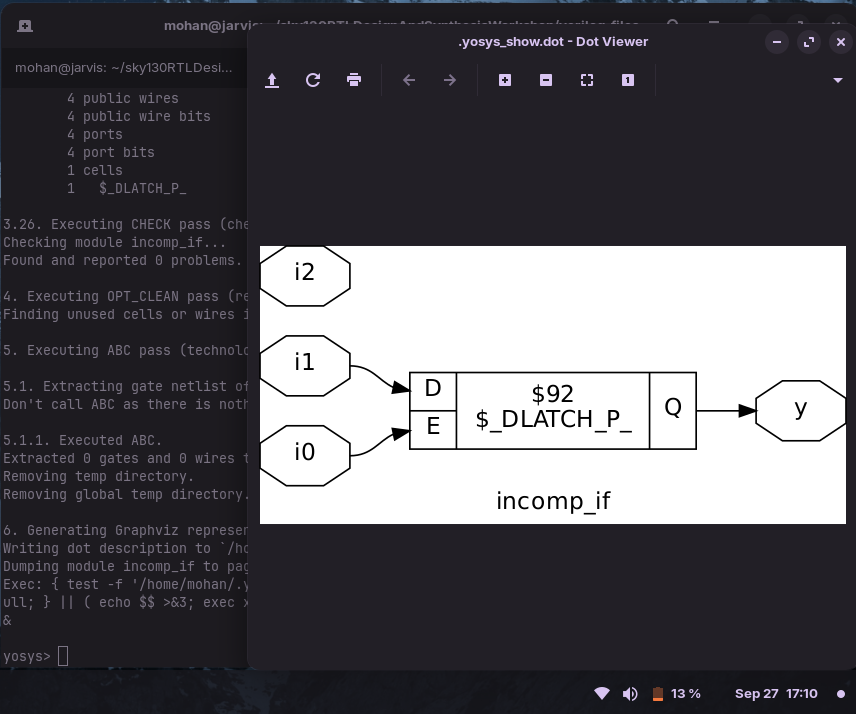
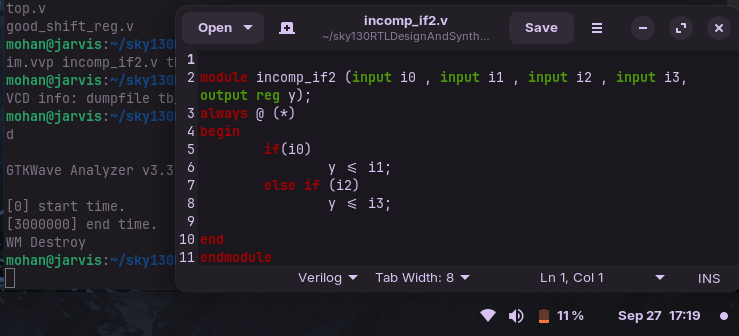
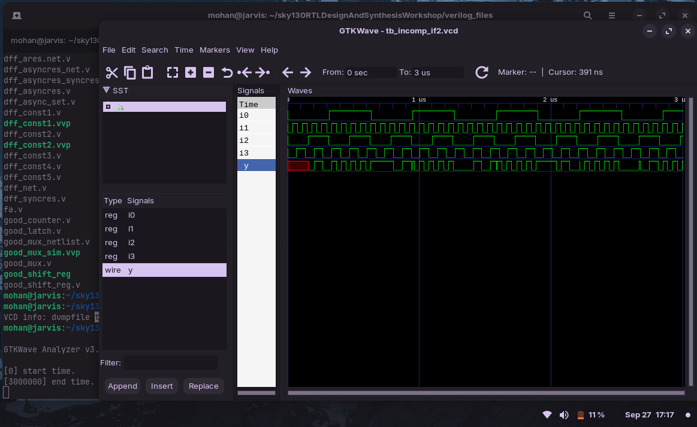
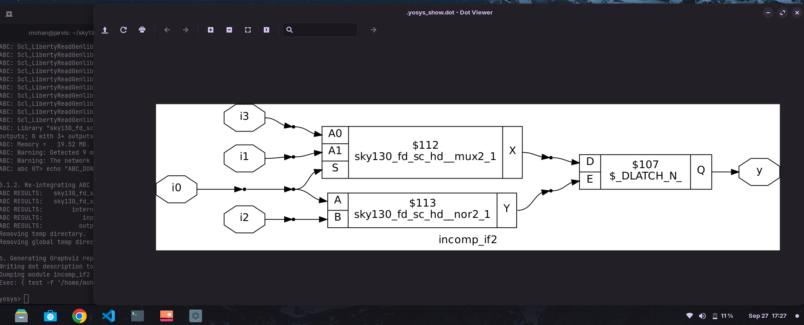
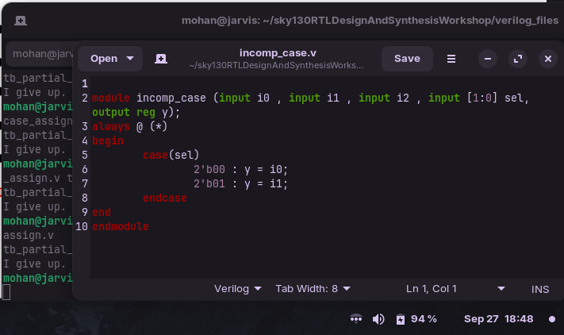
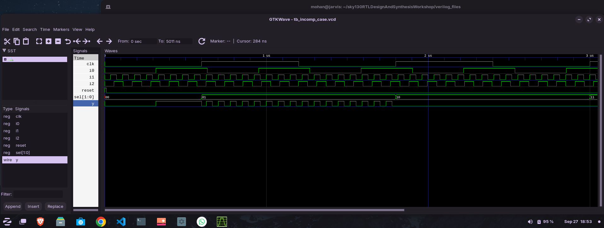
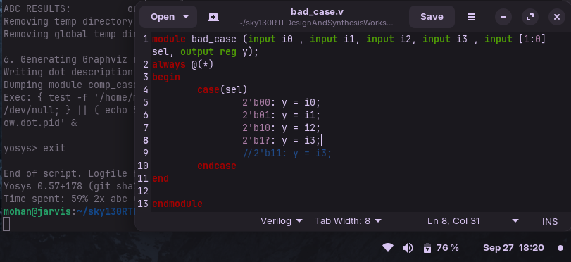
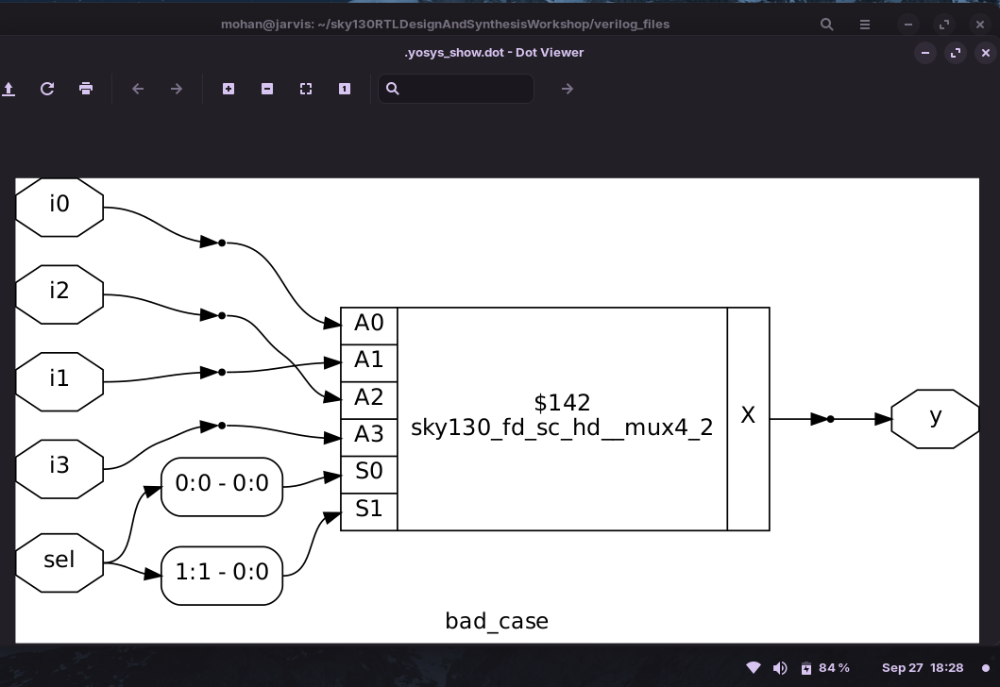
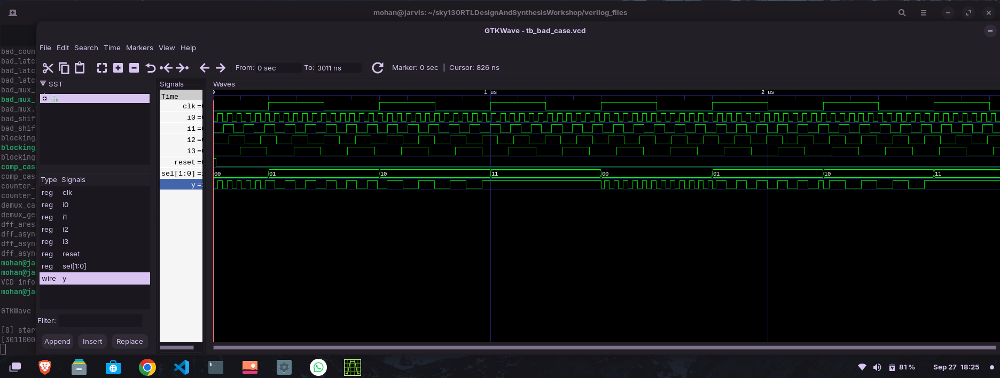

# Day 5 - Optimization in Synthesis  

Welcome to **Day 5 of the RTL Workshop!**  
In this session, we focus on **Verilog conditional constructs (if-else, case, and combined forms)**,  
their impact on **synthesis optimization**, and the issues of **inferred latches**.  
You’ll also run lab experiments to understand these concepts in practice.  

---

## 📑 Table of Contents  

1. [If-Else Statements](#1-if-else-statements)  
2. [Case Statements](#2-case-statements)  
3. [If-Else with Case](#3-if-else-with-case)  
4. [If-Else vs Case](#if-else-vs-case)  
5. [Inferred Latches](#inferred-latches)  
6. [Labs](#labs)  


##  Verilog Conditional Constructs
Two main decision-making constructs in Verilog: **If-Else** and **Case**.

---

### 🔹 1. If-Else Statements
Conditional branching based on Boolean expressions.

  **Syntax**
```verilog
always @(*) begin
    if (condition)
        statement1;
    else
        statement2;
end
```
Example

```verilog

always @(*) begin
    if (sel)
        y = a;
    else
        y = b;
end
```
🔸 Nested If Example:

```verilog
always @(*) begin
    if (sel1) begin
        if (sel2)
            y = a;
        else
            y = b;
    end else begin
        y = c;
    end
end
```
---

### 🔹 2. Case Statements:

- Multi-way branching, useful for MUX or state machines.

**Syntax**
```verilog 
always @(*) begin
    case(expression)
        value1: statement1;
        value2: statement2;
        default: statementN;
    endcase
end
```
Example

```verilog
always @(*) begin
    case(sel)
        2'b00: y = a;
        2'b01: y = b;
        2'b10: y = c;
        default: y = 0;
    endcase
end
```
### 🔹 3. If-Else with Case

- A combination of conditional and multi-way branching.

```verilog
always @(*) begin
    if (enable) begin
        case(sel)
            2'b00: y = a;
            2'b01: y = b;
            2'b10: y = c;
            default: y = 0;
        endcase
    end else begin
        y = 0;
    end
end
```
> [!NOTE]
> Outer if controls enabling condition.
> Inner case selects among multiple inputs.

---

## 📊 If-Else vs Case – Comparison

| Feature            | If-Else                        | Case                                  |
|--------------------|--------------------------------|---------------------------------------|
| **Purpose**        | Binary / nested conditions     | Multi-way discrete selection           |
| **Readability**    | Harder for many conditions     | Cleaner with multiple options          |
| **Default Handling** | Optional (may infer latches) | Must add `default` to avoid latches    |
| **Evaluation**     | Checked sequentially           | Expression matched directly            |

---


##  Inferred Latches in Verilog  

In Verilog, **inferred latches** happen when a combinational block does **not assign a value to an output in all possible paths**. This causes the hardware to "remember" the previous value of the signal.  

Common causes include:  
- Missing `else` in `if-else` statements  
- Missing `default` in `case` statements  
- Partial assignments to vectors or multiple outputs  

These latches can lead to **simulation vs synthesis mismatches**, timing problems, and harder debugging.  

**To avoid inferred latches:**  
- Always assign outputs in every possible branch  
- Use `else` in `if-else` statements  
- Include `default` in `case` statements  

**Example:**  
```verilog
always @(*) begin
    if (enable)
        y = a; // else missing → latch inferred
end
```
**No Latch:**

```verilog 
always @(*) begin
    if (enable)
        y = a;
    else
        y = 0; // all paths covered
end
```

##  Lab 

###  Incomplete If (`incomp_if.v`)



**Observation:**

- If i0 = 1 → y = i1

- If i0 = 0 → y retains previous value → Latch inferred

**simulation:**


**synthesis:**

> [!Note]
> follow the [Day4](https://github.com/MOHANAPRIYANP16/Week-1-VSD-RISC-V-Tapeout-Program-/blob/main/Day4/Day4README.md) steps for synthesis

Dot File



---

### Incomplete If-Else (`incomp_if2.v`)



**Observation:**

- If i0 = 1 → y = i1

- Else if i2 = 1 → y = i3

- If both false → y retains old value → Latch inferred

**simulation:**



**synthesis:**

Dot File:




### Incomplete Case (`incomp_case.v`)



**Observation:**

- Works fine for sel = 00 or 01

- For sel = 10 or 11 → y holds old value → Latch inferred

**simulation:**


**synthesis:**

Dot File:




### Bad Case Example (`bad_case.v`)



**Observation:**

- Missing explicit 2'b11

- RTL simulation → latch may appear

- GLS simulation → latch corrected

**simulation:**


**synthesis:**

Dot File:



## GLS of Bad case :

Gate-Level Simulation is performed using the synthesized netlist (bad_case_net.v).

> [!Note]
> follow the [Day4](https://github.com/MOHANAPRIYANP16/Week-1-VSD-RISC-V-Tapeout-Program-/blob/main/Day4/Day4README.md) steps for Gate level synthesis

gtkwave :




